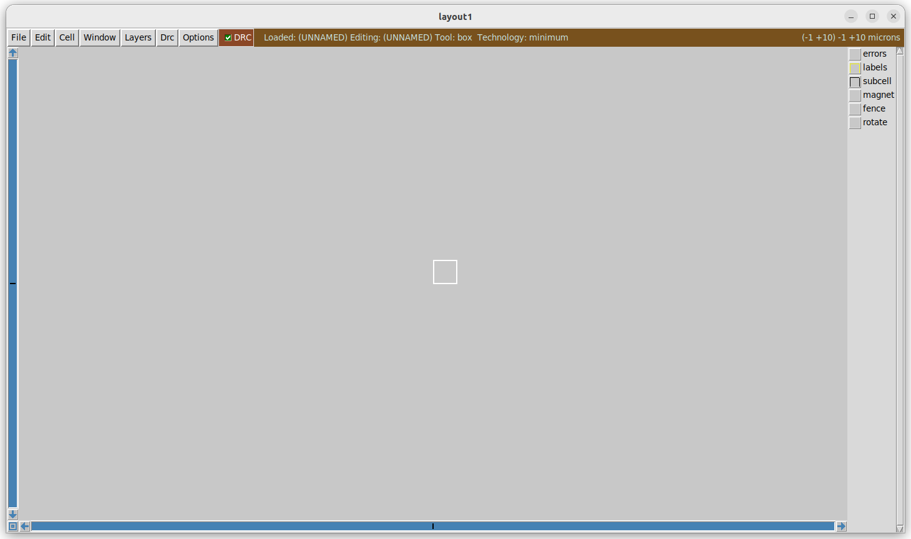

# 🚀 RISC-V Reference SoC Tapeout Program 
<div align="center">

[](https://riscv.org/)
[](https://vsdiat.vlsisystemdesign.com/)

</div>

Welcome to my repository for the **Week 0 of the RISC-V Reference SoC Tapeout Program by VSD**.  
This repo documents **Week 0 Introduction and Setup**, covering *introduction to the chip design flow — from modeling to tapeout* and *setting up environment and installing required tools*.  

---

## 📅 Week 0  

### 📝 Task 1 — Video Summary  
*Digital VLSI SoC Design and Planning*
The VLSI Soc Design process starts at the RTL level and ends at GDSII which is then sent to the foundry(tapeout), the foundry then fabricates the SoC and gives it to us(tape-in).
First we have a testbench which is in C language, we use GCC to compile this code and get O0 which is the reference correct output that we need, our final designed SoC should provide equivalent output as O0 that we got by comipiling the testbench through GCC.
After O0 we using a C like language to write the specs of our SoC(will be explained in detail in further weeks) and use these specs instead of GCC to generate O1. Now we need to verify if O1 is equivalent to O0, if it is, we can verify that the specs we have created are correct and move furrther to RTL.


After this Verilog or verilog like RTL alternative is used to generate the Soft copy of hardware to get O2, once again this O2 output should be equivalent to O1.
Now after further steps which will be explained in detail later, we get the final GDSII which is the collection of standardized files send to the foundry which can fabricate our chip using these files, this GDSII output is O3, once again should be equivalent to O2.


Finally, after getting the fabricated SoC from foundry, we test the SoC using the same testbench in C language to get O4, the final output. 
If O4=O3=O2=O1=O0, then we can say that our design is correct and is called SILICON-PROVEN.


---


### ⚙️ Task 2 — Setup & Tools Installation  

#### **System and Virtual Machine Configuration**

To ensure optimal performance, configure a **Virtual Machine (VM)** with the following specifications:

<div align="center">

| **Specification**     | **Details**       |
|-----------------------|-------------------------|
| **Operating System**  | Ubuntu 20.04+           |
| **RAM**               | 6GB                     |
| **Storage**           | 50GB HDD                |
| **vCPUs**             | 4                       |

</div>

---

#### **2.1 Open-Source EDA Tools Installation**  

Now install the following tools:  

---

##### 🧠 Yosys – RTL Synthesis Tool  
*Yosys converts Verilog RTL designs into gate-level netlists for synthesis and optimization.*  

```bash
# Install dependencies
sudo apt update
sudo apt install make (If make is not installed please it)
sudo apt-get install build-essential clang bison flex \
    libreadline-dev gawk tcl-dev libffi-dev git \
    graphviz xdot pkg-config python3 libboost-system-dev \
    libboost-python-dev libboost-filesystem-dev zlib1g-dev

# Clone and build Yosys
git clone https://github.com/YosysHQ/yosys.git
cd yosys
make config-gcc
# Yosys build depends on a Git submodule called abc, which hasn't been initialized yet. You need to run the following command before running make
git submodule update --init --recursive
make
sudo make install
```
📷 *Installation successful*  
  

✅ **Yosys Successfully Installed**  

---

##### 📟 Icarus Verilog (Iverilog) – Verilog Simulator  
*Icarus Verilog compiles and simulates Verilog designs for functional verification.*  

```bash
sudo apt update
sudo apt install iverilog
```

📷 *Installation successful*  
  

✅ **Iverilog Successfully Installed**  

---

##### 📊 GTKWave – Waveform Viewer  
*GTKWave is used to visualize simulation waveforms for debugging digital circuits.*  

```bash
sudo apt update
sudo apt install gtkwave
```

📷 *Installation successful*  

  

✅ **GTKWave Successfully Installed**  

---

##### Ngspice – Circuit Simulator  
*Ngspice performs analog and mixed-signal circuit simulations.*  

```bash
sudo apt update
sudo apt install ngspice
```

📷 *Installation successful*  
  

✅ **Ngspice Successfully Installed**  

---

##### Magic VLSI – Layout Editor  
*Magic VLSI is an open-source tool for creating and analyzing VLSI layouts with DRC support.*  

```bash
# Install dependencies
sudo apt-get install m4 tcsh csh libx11-dev tcl-dev tk-dev \
    libcairo2-dev mesa-common-dev libglu1-mesa-dev libncurses-dev

# Clone Magic
git clone https://github.com/RTimothyEdwards/magic
cd magic

# Configure, build, and install
./configure
make
sudo make install
```

📷 *Installation successful*  



✅ **Magic Successfully Installed**  

---

#### **2.2 OpenLane Installation (with Docker)**  

*OpenLane is an automated flow for RTL-to-GDSII, using synthesis, placement, routing, and physical verification.*  

##### 🐳 Docker Installation  
*Docker provides a containerized environment to run OpenLane consistently.*  

```bash
# Set up Docker repository
sudo apt-get update
sudo apt-get install ca-certificates curl
sudo install -m 0755 -d /etc/apt/keyrings
sudo curl -fsSL https://download.docker.com/linux/ubuntu/gpg -o /etc/apt/keyrings/docker.asc
sudo chmod a+r /etc/apt/keyrings/docker.asc

# Add Docker repository
echo \
  "deb [arch=$(dpkg --print-architecture) signed-by=/etc/apt/keyrings/docker.asc] https://download.docker.com/linux/ubuntu \
  $(. /etc/os-release && echo \"$VERSION_CODENAME\") stable" | \
  sudo tee /etc/apt/sources.list.d/docker.list > /dev/null
sudo apt-get update

# Install Docker
sudo apt-get install docker-ce docker-ce-cli containerd.io
```

Verify Docker:  
```bash
sudo docker run hello-world
sudo groupadd docker
sudo usermod -aG docker $USER
sudo reboot
# After reboot
docker run hello-world
```
✅ **Docker Successfully Installed**  
📷 *Installation successful* 
  

---

##### OpenLane Installation  
*OpenLane integrates multiple open-source tools (like Yosys, OpenROAD, Magic, Netgen) into a single automated flow.*  

Check dependencies
```bash
git --version
docker --version
python3 --version
python3 -m pip --version
make --version
python3 -m venv -h 
```
Once dependencies verified:

```bash
cd $HOME
git clone https://github.com/The-OpenROAD-Project/OpenLane
cd OpenLane
make
make test
```

📷 *Installation successful*  
  

✅ **OpenLane Successfully Installed**  

---

### 🌟 Key Learnings from Week 0  
- Installed and verified **open-source EDA tools**.  
- Set up **Docker + OpenLane**.  
- Learned about the chip design pipeline from **modeling to tapeout**.  

---

## 🙏 Acknowledgment  

I am thankful to the entire VSD Team and the program partners for this incredible learning opportunity.  

---
